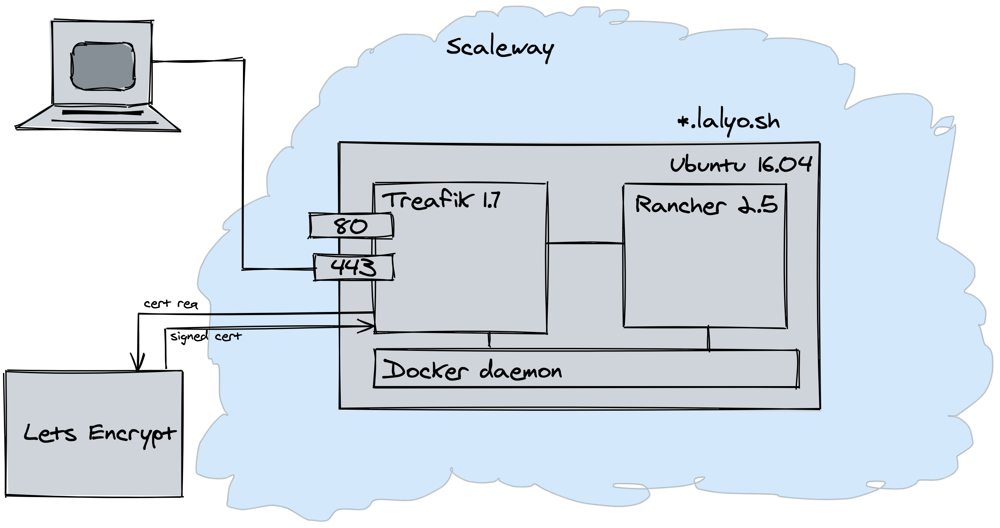

## Overview

This demo consist of
- installing Rancher 2.5
- importing an existing k8s cluster (local dev env)
- provisioning a k8s cluster on Scaleway (this is mimicink your on-prem cluster)
- [optional] provisioning to AWS with RKE

## Installing Rancher 2.5

Rancher is a cluster management solution with a web ui. There are several options to run it. The easiest to run it on docker.



My setup is:
- Ubuntu instance on Scaleway
- Only Docker is installed on it
- Traefik is running (in a container) on ports 80 and 443 with the domain: *.lalyo.sh
- Traefik is handling automatic TLS cert generation, by connecting to [lets encrypt](https://letsencrypt.org/)


Read more on [port requirements](https://rancher.com/docs/rancher/v2.x/en/installation/requirements/#ports-for-communication-with-downstream-clusters)

rancher runs in a docker container describer by a **docker-compose.yaml**
```
version: '3.2'
services:
  rancher:
    container_name: rancher
    image: rancher/rancher
    restart: always
    privileged: true
    labels:
          - traefik.frontend.rule=Host:rancher.lalyo.sh
          - traefik.port=
    command:
      - --acme-domain
      - rancher.lalyo.sh
    ports:
      - "6680:80"
      - "6443:443"
    environment:
      - AUDIT_LEVEL=1
    volumes:
      - /opt/rancher:/var/lib/rancher
      - ./auditlog:/var/log/auditlog
      - /var/run/docker.sock:/var/run/docker.sock
    networks:
      - play-with-docker_default

networks:
  play-with-docker_default:
    external: true
```